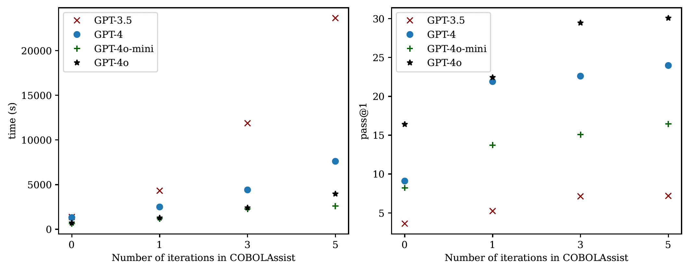

# Can LLM fix its own compilation errors? Benchmarking the Self-Debugging Capabilities of LLM in COBOL Code Generation


This repository contains the **supplementary material** for the COBOLAssist paper, including datasets, artifacts, prompts, and code used in our experiments.

## Dataset

Our manually labeled compilation-error dataset is available at: `data/COBOLErrorSet.xlsx`

The dataset contains COBOL programs, compiler logs, and annotated compilation error categories used in the study.


## Artifacts

### Error taxonomy refinement (mapping to prior work)

To enable comparison between our COBOL compilation-error taxonomy and a prior study that introduced 132 fine-grained error categories, we performed a consolidation and renaming process.

Due to overlap and granularity in the original taxonomy, multiple categories can be grouped under broader categories aligned with our definitions. This refinement ensures consistent analysis and allows comparison between human-written and LLM-generated COBOL code.

**Mapping summary:**

- **Period Missing After + Period Added → Unterminated Statements**  
  Incorrect statement termination caused by missing or misplaced periods.

- **Name Definition + Hyphenation Missing in Non-structural Word + Multi Definition of Name → Undefined Object**  
  Identifier declaration or reuse issues (e.g., undeclared or ambiguous names).

- **Data Description (Format, Value, Invalid) → Incorrect Data Type**  
  Type specification errors, invalid formats, and value mismatches.

- **Misspelling in Dataname → Incorrect Use of Variable**  
  Typographical mistakes leading to invalid variable references.

- **Missing/Misplaced Structurals + Class and Semantic + Conjunction + Sentence Structure + Miscellaneous Sentinel + Hyphenation in Structural Word → Incorrect Use of Program Structures**  
  Structural syntax violations affecting control flow and logic.

- **Remaining categories → Others**  
  Categories that do not clearly map to our taxonomy.

This corresponds to the artifact referenced in the paper when describing taxonomy refinement.


### COBOLAssist Prompt 

COBOLAssist performs self-debugging by embedding compiler feedback into a structured follow-up prompt.

The prompt instructs the model to adopt the persona of an experienced COBOL engineer and separates the input into code and compiler log sections.

**Prompt used in our experiments:**

```
You are an experienced COBOL software engineer with deep knowledge of COBOL syntax, structure, and best practices.

Your task is to debug a COBOL program that contains compilation errors.

Below is the original COBOL code followed by the compiler error log.
Revise the code to resolve all compilation errors, ensuring that the corrected program is syntactically valid and logically sound.

Carefully analyze the error messages and update the code accordingly.
Prioritize clarity, maintainability, and adherence to COBOL structural rules.

Input:

COBOL Code:
[code]

Compiler Error Log:
[error_log]
```


### Iteration Ablation (Number of Self-Debugging Rounds)

We conduct an ablation study to evaluate the effect of the maximum number of debugging iterations.

Configurations:

- **0 iterations** — no COBOLAssist (raw LLM output)
- **1 iteration**
- **3 iterations (default)**
- **5 iterations**



We analyze the impact on:

- Effectiveness (Pass@1)
- Runtime (generation + compilation time)

**Key observations:**

- Pass@1 improves with more iterations.
- Strong models (e.g., GPT-4, GPT-4o) benefit most.
- Weaker models show limited gains despite increased runtime.
- Improvements beyond **3 iterations** show diminishing returns.

Therefore, three iterations provide a practical balance between effectiveness and efficiency.


## Code

### Installation

COBOLAssist uses [GnuCOBOL](https://gnucobol.sourceforge.io/) to compile the generated COBOL solutions. Download version 3.2.0 here and follow the installation instructions: https://sourceforge.net/projects/gnucobol/files/.

Check that the installation was successful with:

```
>>> cobc -v
cobc (GnuCOBOL) 3.2.0
```

Using Python3.10 or later:

```
python -m venv coboleval
source coboleval/bin/activate
pip install -r requirements.txt
```

#### Generate completions

Configure the model and the number of samples-per-problem in `scripts/generate.py` then run. 

```python
if __name__ == "__main__":
    model = Model(name="gpt-4", samples_per_task=1)
    runner = OpenAIChat(model)
    runner.eval()
```

This will create a `samples.jsonl` file in `preds/gpt-4` which contains the generated COBOL solutions.

#### Calculate Pass@k

Configure the model and the number of samples in the `entrypoint()` function in `scripts/evaluate_functional_correctness.py`:

```python
def entrypoint():
    all_results = []
    run_folders = ["gpt-4"]  # edit
    for folder in run_folders:
        all_results.append(eval(f"preds/{folder}", "1"))

    for res, folder in zip(all_results, run_folders):
        print(f"{folder}: {res}")
```

